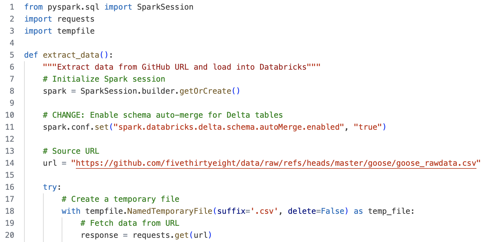

# Mini Project 11: Data Pipeline with Databricks

## Project Purpose
This project creates a Databricks-based ETL pipeline for processing and analyzing baseball relief pitching statistics, involving PySpark for data processing, Docker containerization for development environment consistency, etc.  

## Project Data Source
The data used in this project comes FiveThirtyEight's public dataset: https://raw.githubusercontent.com/fivethirtyeight/data/refs/heads/master/goose/goose_rawdata.csv 

## Project Highlights
1. Automated ETL pipeline using Databricks.
2. Delta Lake integration for reliable data storage
3. Comprehensive relief pitcher performance analysis
4. Docker containerization for development
5. Automated testing suite

## Project Structure
```
├── .devcontainer/        
├── .github/              
├── .pytest_cache/        
├── mylib/               
│   ├── data/           
│   ├── __init__.py     
│   ├── ETL.py          
│   ├── ETL_nb          
│   ├── Query.py        
│   └── Query_nb        
├── .env                
├── .gitignore         
├── check              
├── Dockerfile        
├── LICENSE           
├── main.py           
├── Makefile          
├── README.md         
├── repeat.sh         
├── requirements.txt  
├── setup.sh          
└── test.py           
```
## Project Workflows

**1. Setup**
* Configure environment variables
* Install dependencies
* Initialize Databricks connection

**2. Pipeline Execution**
* Data extraction from FiveThirtyEight
* Transform: clean, deduplicate, calculate metrics
* Load to Delta tables
* Generate analysis reports

## Data Pipeline Components
### ETL (ETL.py)

- Extracts data from FiveThirtyEight



- Performs data cleaning and transformation


- Loads to Delta tables


### Query (Query.py)

- Calculates performance metrics
- Generates league statistics
- Creates player rankings
- Analyzes team performance


### Results
#### Job Runs


#### Output


Pipeline outputs stored in Delta tables:

- `/dbfs/FileStore/tables/goose_data: Raw data`
- `/dbfs/FileStore/tables/processed_goose_data: Transformed data`
- `/dbfs/FileStore/tables/analysis_top_performers: Analysis results`


